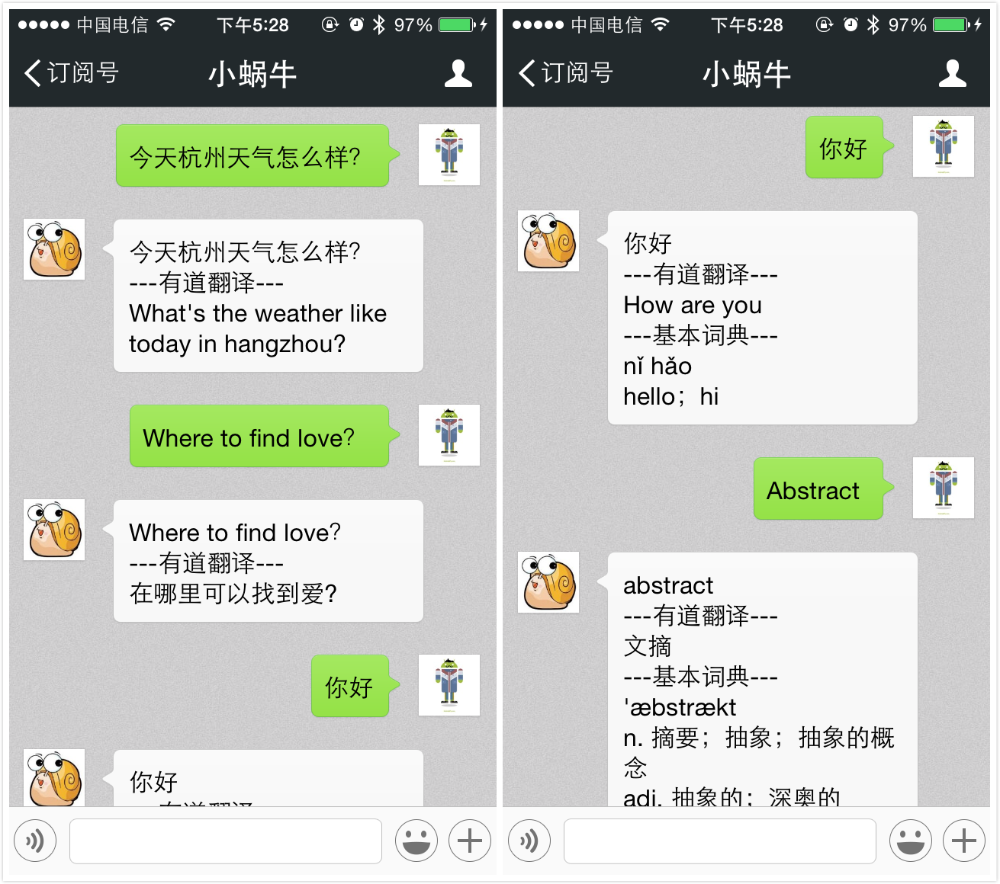

littlesnail
===========
### 简介
A YouDao Translation WeChat Robot Demo with Django.

一个用Django实现的微信公众账号自动回复机器人。

本项目仅仅是一个Demo，展示了如何利用微信公众账号自动回复的API来实现一个自动回复机器人。最初为了演示，项目部署在[SAE](http://sae.sina.com.cn/)上，目前项目部署在[DigitalOcean](https://www.digitalocean.com/?refcode=22b5cd61f32c)上。项目中`config.yaml`和`index.wsgi`是部署在SAE上所必需的文件，如果部署在自己的Server上就不需要了。

### 闲扯
想当初写这个时微信公众账号平台还在起步阶段，那时还几乎没人用微信公众账号做自媒体，文档非常不完善，功能远不及现在丰富。而现在文档完善，后台管理页面也变得易用，功能也更加丰富，增加了很多新的功能，如自定义菜单等等，更多细节请阅读官方文档。

此外，那时我的代码很稚嫩，后来不愿意花精力去维护，还望多多包涵。

更多信息请移步[这里](http://blog.vars.me/2013/07/24/wei-xin-ji-qi-ren-xiao-gua-niu-you-dao-fan-yi-xiao-zhu-shou-django-plus-sae-plus-wei-xin-gong-zhong-zhang-hao-zi-dong-hui-fu-kai-fang-jie-kou/).

此外账号欢迎调戏，我也会不定期通过该账号发一些杂文。

### Tips
注意Django的版本，在1.6中`request.raw_post_data`变为`request.body`

### Screenshots

### 向我捐助
欢迎用支付宝钱包扫码随手捐助我。 

